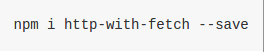
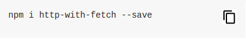

# Easy copy

A chrome extension to easily copy code snippets from StackOverflow and Github.

# How to install

* Download the `.crx` file that is available in the [Releases](https://github.com/faizaanceg/chrome-easy-copy/releases) page.
* Open `chrome://extensions` in a new tab.
* Drag and drop the `.crx` file into the tab.
* Start copying snippets easily :) 

# Before extension

 

# After extension

**Yay!**  
